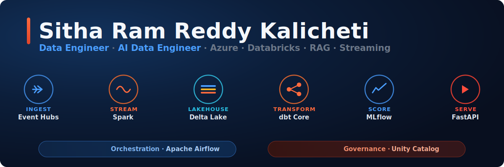

<!-- Ram-kalicheti/Ram-kalicheti profile README -->

  
  
  
  
  
  

### About

Data engineer with 3+ years of enterprise delivery at Infosys, building cloud data integration platforms on Azure for Big 4 clients across SAP SuccessFactors, Salesforce, and Workday ecosystems. Recent work focuses on streaming and lakehouse architecture: exactly-once processing, tested transformations, and governance an auditor could sign off on. I care most about the parts people skip, replay safety, data quality gates, honest model evaluation, and documenting what broke and why.

`Open to Data Engineer and AI Data Engineer roles - Azure · Databricks · Streaming - Virginia, USA`

### Core Stack

**Platform**
&nbsp;

**Pipeline**
&nbsp;

**ML & Serving**
&nbsp;

**Data & Governance**
&nbsp;

### Featured Work

**[Sentinel](https://github.com/Ram-kalicheti/sentinel)** &nbsp; Real-time financial fraud intelligence on Azure Databricks

Transactions stream through Event Hubs into a bronze-silver-gold medallion in Delta Lake with exactly-once processing and idempotent MERGE, are scored by an XGBoost model behind an MLflow promotion gate, and surface on a fraud-analyst dashboard governed by Unity Catalog. The model is gated: it ships only if it clears a cross-validated bar, and in this build it did not, so the pipeline held it back and the dashboard says so plainly. Serving runs at 17ms P99 off a Redis feature store.

`Azure Databricks` `Spark Structured Streaming` `Delta Lake` `Event Hubs` `Airflow` `dbt Core` `MLflow` `Unity Catalog` `FastAPI` `Redis`

**[Meridian](https://github.com/Ram-kalicheti/meridian)** &nbsp; Multi-tenant AI document intelligence on Microsoft Fabric

A cross-tenant medallion pipeline embeds documents into Azure AI Search for hybrid vector and BM25 retrieval, served through a token-governed API with release-gating on retrieval quality. RAGAS context precision reached 0.92 against a 0.85 gate, with per-tenant token budgets enforced at the API Management layer and Redis semantic caching.

`Microsoft Fabric` `Azure Data Factory` `Azure OpenAI` `Azure AI Search` `APIM` `FastAPI` `Terraform` `Power BI`

More: <a href="https://github.com/Ram-kalicheti/cloud-observability-agent">Multi-Cloud Observability Agent</a> · <a href="https://github.com/Ram-kalicheti/self-healing-infra">Self-Healing Infrastructure</a>

### Experience

**Infosys** &nbsp; Data Engineer (Systems Engineer to Technology Analyst) &nbsp; · &nbsp; Oct 2021 - Dec 2024

Delivered cloud data integration platforms on Azure for Big 4 clients (KPMG, PwC) across SAP SuccessFactors, Salesforce, and Workday ecosystems. Consolidated legacy point-to-point integrations into unified, orchestrated pipelines, cutting client operating costs and manual handoffs. Left December 2024 to pursue an M.S. in Applied Information Technology at George Mason University.

### Certifications

<i>Invisible when it works, obvious when it breaks. I build the parts that keep working.</i>
